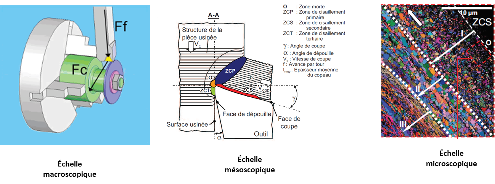
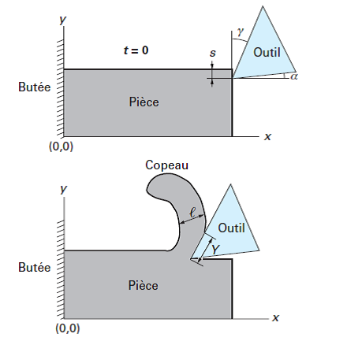
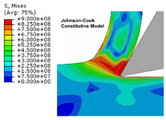

# Simulation numérique de l'usinage : un état de l'art en vue de la constitution d'une base de données matérielles

## I Contexte
Une opération d'usinage par machine-outil à commande numérique sollicite des moyens mécaniques souvent complexes, onéreux et nécessite une vigilance accrue pour minimiser les coûts de fabrication. Il est alors primordial de pouvoir simuler les différentes opérations d'usinage avant de lancer la fabrication pour  
- vérifier le mouvement des pièces usinées et des outils afin de détecter d'éventuelles collisions pendant le processus ;
- estimer le volume de matière enlevée ;
- certifier la trajectoire d'outil générée par un logiciel de FAO, en conformité avec la machine.

Ces simulations sont généralement effectuées par un logiciel de FAO à partir de modèles géométriques[1]. Cependant, elles souffrent d'un manque de précision concernant la géométrie obtenue et ne permettent pas d'anticiper certains problèmes (aptitude à l'usinage, modes d'usure et d'endommagement des outils, qualité de surface de la pièce usinée).

Afin d'optimiser les conditions d'usinage, différentes méthodes peuvent être mises en oeuvre :  
- les méthodes expérimentales, longues et coûteuses, où la zone de fonctionnement idéale est recherchée au travers d'un plan d'expérience ;
- les méthodes numériques, utilisant un modèle de coupe à une échelle d'observation particulière (cf. figure 1).

**Figure 1 : Les différentes échelles de modélisation de la coupe des métaux[4]. A l'échelle microscopique, la cartographie EBSD dévoile la microstructure du copeau dans la zone de contact avec l'outil.**

Ces modèles sont basés sur différentes approches :  
- les approches empiriques, basées sur un grand nombre de données expérimentales, comme le couple outil-matière (échelle macroscopique) ;
- les approches phénoménologiques ou mécanistes, basées sur des modélisations simples retranscrivant le comportement mécanique (échelle mésoscopique) ;
- les approches physiques (échelle microscopique) ou thermomécaniques (échelle mésoscopique), fondées sur des lois de comportement plus ou moins évoluées.

Ces modèles permettent de prédire la géométrie des copeaux, les forces de coupe et les échauffements à partir des conditions de coupe et des matériaux usinés et d'outil. En particulier, l'énergie spécifique de coupe (aussi appelée pression spécifique de coupe) $K_c$ est un paramètre important car il permet d'avoir accès à l'effort de coupe $F_c$, à la puissance de coupe $P_c$ et au couple à la broche.

Les approches empiriques relient $K_c$ (W.s.m-3) à l'épaisseur du copeau $\ell$ (mm) par une fonction analytique :

$$ 
K_c = K_{c1}\times \ell^{-m_c} 
$$

Les paramètres $K_{c1}$ et $m_c$ sont déterminés expérimentalement et tabulés.

Les approches mécanistes permettent d'avoir accès aux efforts locaux à partir des conditions de coupe locales. Dans le cas de la coupe orthogonale (cf. figure 2), le modèle de Merchant considère que la formation du copeau s'effectue par cisaillement. Il permet de calculer l'effort de coupe $F_c$ à partir des paramètres géométriques de la coupe (avance $s$, profondeur de passe $w$, angle de coupe $\gamma$), et de paramètres matériels (l'angle d'adhérence $\Phi$ dans le cas d'un frottement de Coulomb et la contrainte maximale de cisaillement admissible $k$ pour un matériau rigide parfaitement plastique) :

$$
F_c = 2ksw\tan\left( \frac{\pi}{4}+\frac{\Phi - \gamma}{2}\right)
$$

Le paramètre $k$ est proportionnel à la limite élastique et à la dureté. Le modèle donne aussi une estimation de l'épaisseur du copeau et de la longueur de contact entre le copeau et l'outil (toutes deux proportionnelles à l'avance $s$). A partir de l'effort de coupe, on peut alors calculer l'énergie spécifique de coupe $K_c = \frac{F_c}{sw}$ (W.s.m-3), la puissance de coupe $P_c = K_cQ$ (W) avec $Q=swV_c$ (m3.s-1) le débit de matière et $V_c$ la vitesse de coupe et enfin le couple à la broche $C=\frac{P_c}{\omega}$ (N.m) pour une vitesse angulaire $\omega$ (cas du tournage).

Ce modèle a tendance à sous-estimer les efforts de coupe, l'épaisseur du copeau et la longueur de contact. De plus, les modèles purement mécaniques ne prédisent pas la décroissance de $K_c$ avec l'avance $s$.

**Figure 2 : Géométrie de la coupe orthogonale[2].**

Les approches thermomécaniques permettent d'avoir accès aux déformations locales et aux contraintes résiduelles de la pièce et de l'outil. Elles permettent de prédire précisément la géométrie finale de la pièce et d'avoir accès à certaines grandeurs qualifiant l'état mécanique des composants (dureté, usure...). Elles sont généralement mises en oeuvre par simulation numérique à l'aide de la méthode des éléments finis. 

## II Simulation numérique de l'usinage
### II.1 Objectif et difficultés
L'objectif de la simulation numérique de l'usinage est d'apporter une contribution à la compréhension des phénomènes liés à la coupe des métaux, en particulier dans la zone de contact entre l'outil et le matériau à usiner. Elle permet de fournir la géométrie du copeau et une estimation de la distribution des grandeurs physiques dans le matériau usiné : vitesse de déplacement, tenseur des vitesses de déformation et des contraintes, déformation plastique, température, voire d'autres grandeurs caractérisant l'évolution métallurgique du matériau usiné (nature des phases, taille des grains, dureté, contraintes résiduelles...) ou son endommagement dans le copeau et en dessous de la surface créée par usinage. On peut aussi se proposer d'étendre l'approche à l'outil (en le supposant en première approximation thermoélastique) pour y estimer le champ de contrainte et de température et ainsi aborder directement le problème de sa dégradation et de son usure. Elles sont donc potentiellement très riches et puissantes.

Plus précisément, cela revient à estimer la valeur numérique de ces grandeurs en des points particuliers associés à un maillage en construisant une solution approchée du système d'équations décrivant l’écoulement de matière et de chaleur. Ce système étant non linéaire, ces approches ne sont développées que très lentement et progressivement. L'usinage est l'une des configurations qui combinent en effet un grand nombre de difficultés proprement numériques :  
- géométrie du copeau indéterminée ;
- gestion du contact (les efforts de contacts et les surfaces en contact sont des inconnues du problème) ;
- gradients de déformations, vitesses de déformations et températures
très élevés dans une zone confinée ;
- couplage thermomécanique fort.

Sur le plan physique s'ajoutent, pour la confrontation des résultats à l'expérience, les incertitudes sur la rhéologie du matériau usiné et la loi de frottement du copeau sur l’outil. Depuis les années 1990, le développement des algorithmes de calcul par éléments finis et l'augmentation de la puissance de calcul des ordinateurs a permis de simuler directement le processus de formation du copeau en déformation plane. De ce fait, la modélisation de l'usinage reste pour l'instant un domaine de recherche pointue et demande d'acquérir une expertise poussée dans différents domaines tels que la coupe des métaux, la mécanique des milieux continus, notamment en grandes transformations, la tribologie, la résistance des matériaux, la thermique, la métallurgie ainsi que la méthode des éléments finis.

### II.2 Modélisation de la coupe orthogonale
La simulation de la coupe orthogonale reste à ce jour le seul cas d'usinage traité numériquement car les hypothèses de modélisation (équilibre mécanique quasi-statique et régime thermique permanent de la phase stabilisée d'usinage, déformations planes en 2D) permettent de trouver un compromis acceptable entre le temps de calcul et la qualité des résultats.

Le principe de la simulation d’une coupe orthogonale pure est donné sur la figure 2 : la pièce est un bloc rectangulaire qui est bloqué par une butée ; l’outil est initialement à l’extérieur de la pièce et son arête est située à une certaine distance de la surface supérieure de la pièce (avance $s$) . Animé d’une vitesse horizontale (vitesse de coupe), l’outil rentre progressivement dans la pièce et le code de calcul fournit directement le processus de formation du copeau en début d’usinage en résolvant simultanément les équations mécaniques et l’équation de la chaleur.

Les principaux modèles physiques utilisés sont :  
- un modèle de transfert de chaleur couplé à la mécanique ;
- un modèle rhéologique thermo-élasto-visco-plastique pour le matériau usiné et généralement thermo-élastique pour l'outil ;
- un modèle de frottement entre le matériau et l'outil (type Coulomb ou Tresca).

Le tableau 1 indique les principales propriétés indispensables pour une formulation thermo-élasto-plastique (sans écrouissage).

 Propriété           | Symbole | Unité  
:-------------------:|:-------:|:------:
 Masse volumique     | $\rho$  | kg.m-3 
 Module de Young     |   $E$    |   Pa  
 Coefficient de Poisson |$\nu$ |   -    
 Limite élastique    | $R_e$ | Pa
 Coefficient de frottement|$\mu$| -
 Dilatation thermique|$\alpha$ | K-1 
 Chaleur spécifique  | $C_p$   | J.kg-1.K-1
 Conductivité thermique|$\lambda$| W.K-1.m-1
 
**Tableau 1 : Propriétés thermiques et mécaniques.**

Etant donné les forts gradients thermiques dans la zone de coupe (températures pouvant atteindre plusieurs centaines de degrès Celsius), il est indispensable d'avoir accès aux variations des coefficients de ces modèles avec la température. 

Il existe quantités de lois de comportement (visco-)plastiques. La loi de Johnson-Cook est souvent utilisée pour modéliser la visco-plasticité de certains métaux soumis à de grandes vitesses de déformation (aciers bas et moyen carbone, aluminium, titane, laiton, cuivre, tungstène). Il relie la déformation plastique $\varepsilon_p$ à la contrainte d'écoulement $\sigma_y$ ($T$ désigne la température) :

$$
\sigma_y = \left[A+B\left(\varepsilon_p\right)^n\right]\left[1+C  \ln\left(\frac {\dot{\varepsilon}_p}{\dot{\varepsilon}_0}\right)\right]\left[1-\left(\frac{T-T_0}{T_f - T_0} \right)^m \right]
$$

Cette loi phénoménologique compte 8 paramètres empiriques à identifier ($A$, $B$, $C$, $n$, $m$, $\dot{\varepsilon}_0$, $T_0$, $T_f$). Des variantes de cette loi existent, faisant intervenir encore plus de paramètres[3].  

D'autres modèles peuvent être introduits :  
- un modèle d'endommagement de la matière usinée ;
- un modèle de fissuration ;
- un modèle métallurgique ;
- un modèle d'évolution de la microstructure ;
- ...

Ces modèles, parfois complexes, demandent une identification de leurs paramètres qui peut être fort délicate.

Au sein de la méthode des éléments finis, les principales méthodes de résolution utilisées sont :  
- une méthode de résolution de l'équilibre mécanique globale de la structure (type Newton) ;
- une méthode de résolution de l'équilibre thermique (type $\theta$-méthode) ;
- des méthodes d'intégration des lois de comportement des matériaux (implicites ou explicites) ;
- une méthode de remaillage automatique (type ALE) ;
- une méthode de gestion du contact (maître-esclave, multiplicateurs de Lagrange,...).

Ces méthodes peuvent s'avérer très chronophages voire rédhibitoires en terme de mémoire et de temps de calcul (plusieurs dizaines d'heures pour la formation d'un copeau de 1 mm de long).

### II.3 Résultats atteignables

La simulation par éléments finis permet d'accèder aux distributions de déplacement, d'effort de réaction, de vitesses de déformation, de contraintes (cf. figure 3), de températures. Elle donne aussi accès à des paramètres directement utilisables par l'usineur :  
- la géométrie du copeau qui permet d'estimer le débit de matière usinée ;
- l'effort de coupe qui permet d'estimer le couple à la broche et la puissance de coupe.

De plus, elle permet d'étudier l'effet des divers paramètres de coupe (angle de coupe, vitesse de coupe, coefficient de frottement, avance, arrondi de l'arête de coupe) et permet de prendre en compte la géométrie exacte de l'outil (et d'un défaut initial potentiel).

**Figure 3 : Distribution de la contrainte équivalente de von Mises[3].**

### II.4 Limites actuelles et orientations futurs
La modélisation de l'usinage reste un domaine très délicat à mettre en données car elle met en jeu des déformations par cisaillement très importantes, des températures de plusieurs centaines de degrés et des vitesses de déformation de l'ordre de plusieurs dizaines, voire centaines de milliers de s-1, ce qui rend très difficile la mesure du comportement mécanique nécessaire à la simulation de la coupe, car les dispositifs actuels qui permettent d'approcher de telles vitesses de déformation (barres de Hopkinson) posent des problèmes d'interprétation (hétérogénéité de déformation, rôle du frottement en compression, échauffement...). 

La simulation de la coupe orthogonale, seule configuration étudiée dans les travaux de recherche à l'heure actuelle, est généralement limitée à quelques millimètres d'usinage pendant quelques millisecondes. Elle n'a donc pas la prétention de prédire le comportement, l'usure, la durée de vie... de l’outil lors d'une opération d'usinage, mais contribue à la compréhension des phénomènes physiques impliqués.

Les recherches actuelles s'attachent à développer des modèles rhéologiques et de frottement plus représentatifs, notamment pour l'usinage à grande vitesse. Elles s'orientent vers l'intégration de lois d'évolution de microstructure [3], d'usure, de prise en compte d'interaction fluide-structure (assistance à jet d'eau).

## III Constitution d'une base de données matérielles pour l'usinage : spécifications et recommandations

Les matériaux sont généralement regroupés en 4 grandes classes : les métaux, les céramiques (regroupées avec les verres), les polymères (avec les élastomères) et les matériaux hybrides (composites, mousses, bois). Au sein de ces classes, on définit des familles (par exemple la famille des aciers pour la classe des métaux). Ces familles sont elles-mêmes hiérarchisées en sous-structures suivant le niveau d'exhaustivité qu'on recherche.

Comme les métaux sont la classe la plus représentée des matériaux usinés (en particulier, les aciers), on pourra les diviser en 6 grandes familles conformément à la norme ISO[5] :  
- les aciers ;
- les aciers inoxydables ;
- les fontes ;
- les alliages d'aluminium ;
- les alliages réfractaires ;
- les aciers trempés.

Les matériaux de coupe sont principalement assimilés à la classe des céramiques. On pourra différencier les familles suivantes :  
- les aciers au carbone, au tungstène ;
- les carbures (cémentés revêtus ou non, cermet) ;
- les céramiques ;
- les diamants.

Etant donné le nombre pléthorique de matériaux, en particulier de nuances au sein d'une même famille d'aciers, il n'est pas nécessaire, dans un premier temps, de multiplier les sous-familles. De plus, pour chaque famille de matériau, on pourra donner soit une valeur représentative, soit un intervalle de valeurs, des propriétés du tableau 1, à température ambiante. Comme les lois de comportement des matériaux usinés et d'outil ne sont a priori pas connus (c'est à l'utilisateur de les définir), notamment concernant les propriétés visco-plastiques du matériau usiné, il n'est pas utile d'en proposer plus. 

On trouvera des exemples de base de données matérielles sur Wikipédia[6], comme Matweb[7] ou Matmatch[8]. La page Wikipédia "Liste de propriétés d'un matériau" renvoie vers des pages contenant généralement des tableaux de valeur par type de matériaux. Ces valeurs pourront servir pour une mise en données par défaut d'une simulation simplifiée, voire pour un modèle mécaniste simplifié, comme le modèle de Merchant. Dans ce cas, la donnée de $\mu = \tan \Phi$ et de $R_e=\sqrt{3}k$ est suffisante.

## Références
### Bibliographie
[1] Fikret Kalay, _Simulation numérique de l'usinage - Application à l'aluminium AU4G (A2024-T351)_, Techniques de l'ingénieur, BM 7002 (2010).  
[2] Eric Felder, _Modélisation de la coupe des métaux_, Techniques de l'ingénieur, BM 7041 (2006).  
[3] Shreyes Melkote, Wit Grzesik, José Outeiro, Joel Rech, Volker Schulze, et al., _Advances in material and friction data for modelling of metal machining_, CIRP Annals - Manufacturing Technology, Elsevier, 2017, 66 (2), pp.731-754.  
[4] Cédric Courbon. Vers une modélisation physique de la coupe des aciers spéciaux : intégration du comportement métallurgique et des phénomèes tribologiques et thermiques aux interfaces. Thèse de doctorat. Ecole Centrale de Lyon (2011).

### Sitographie
[5] www.sandvik.coromant.com  
[6] https://en.wikipedia.org/wiki/Materials_database  
[7] www.matweb.com  
[8] https://matmatch.com  

